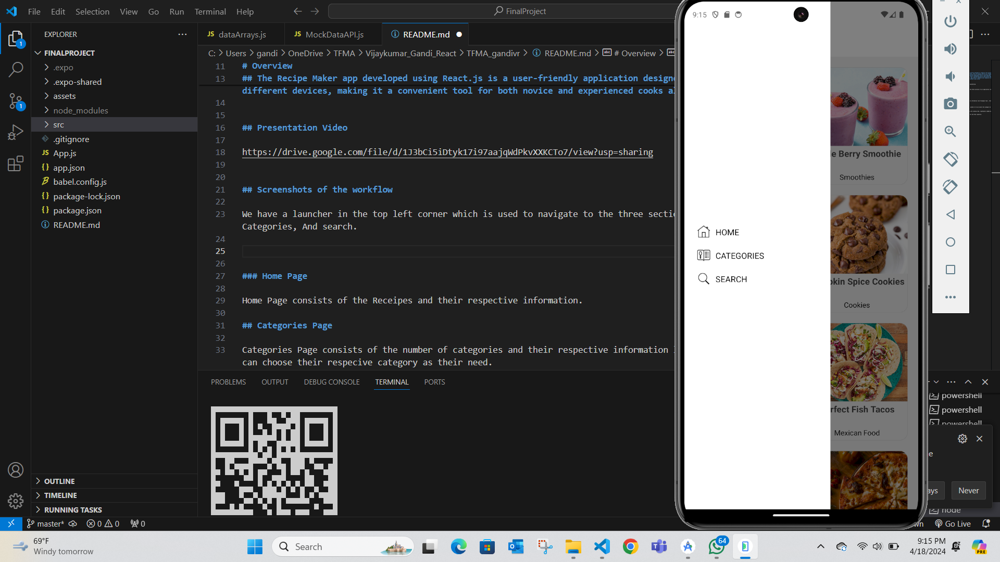
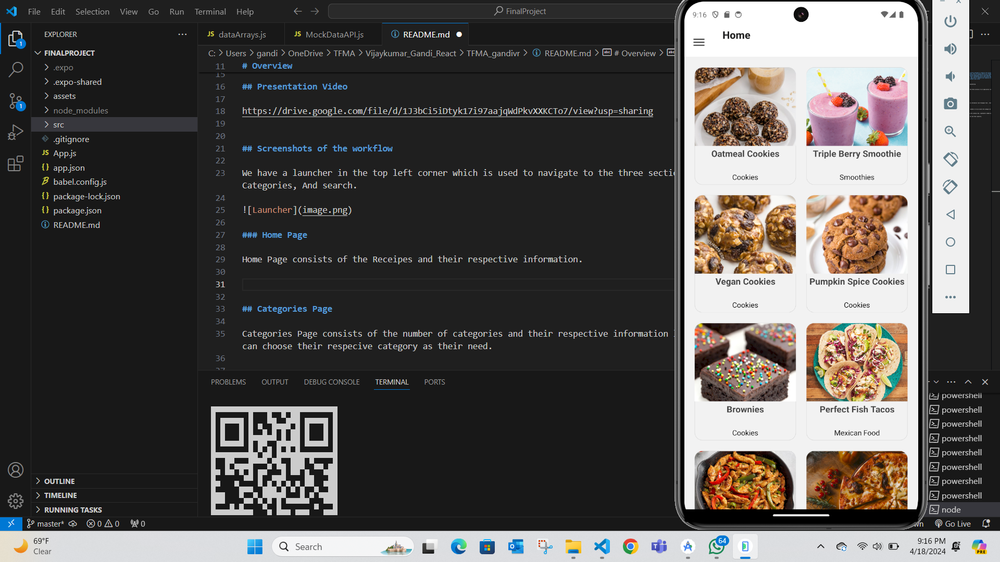
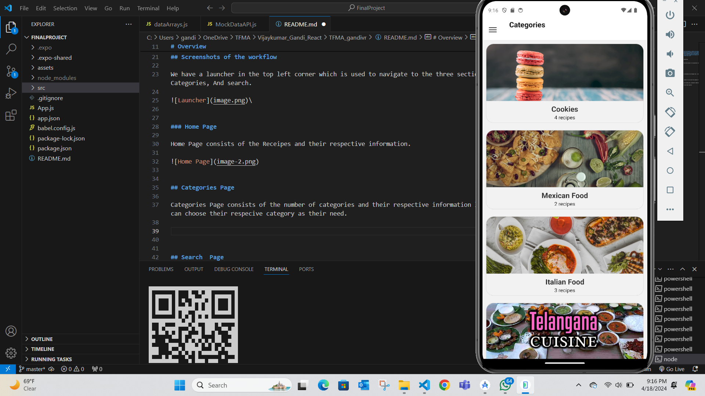
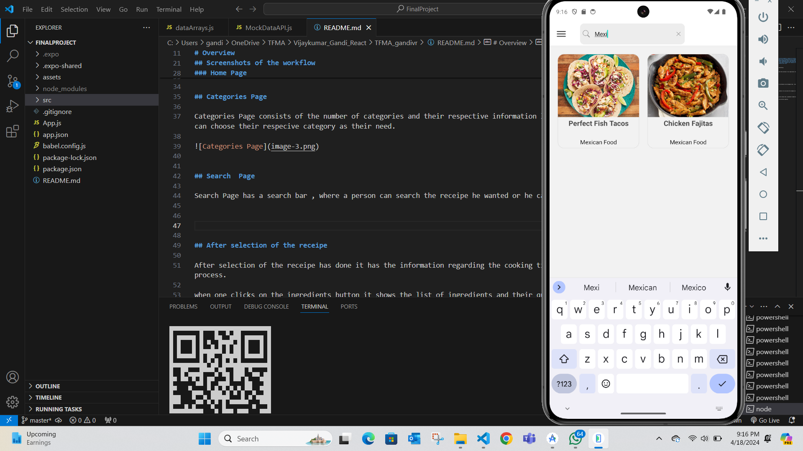
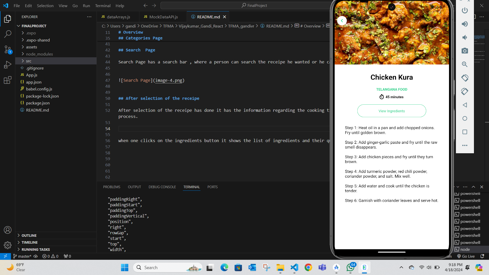
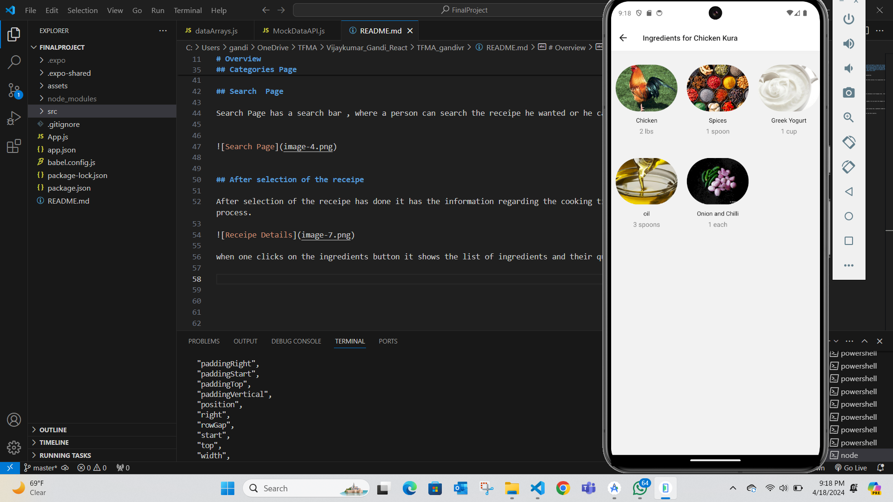
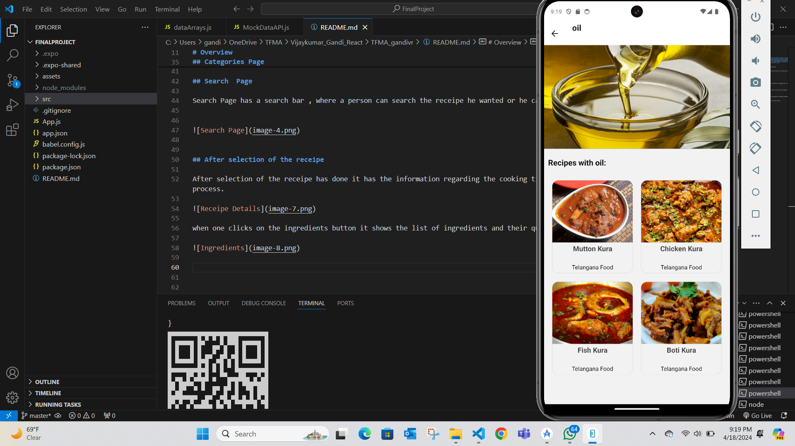

# Recipe Maker

## Personal Mobile App Project Final

## Student 

## Name: Vijaykumar Gandi

## Email: gandivr@mail.uc.edu

# Overview

## The Recipe Maker app developed using React.js is a user-friendly application designed to simplify the process of discovering, saving, and cooking the receipes. With a clean and intuitive user interface, users can easily search for recipes based on criteria such as Categories, cooking time , ingredients and more. The app provides detailed recipe information including ingredients, preparation steps, cooking time.Additionally, the app may include some features in future development such as meal planning, grocery list generation, and social sharing capabilities, allowing users to organize their cooking adventures efficiently and share their culinary creations with friends and family. Powered by React.js, the Recipe Maker app offers a seamless and responsive experience across different devices, making it a convenient tool for both novice and experienced cooks alike.

## Presentation Video

https://drive.google.com/file/d/1J3bCi5iDtyk17i97aajqWdPkvXXKCTo7/view?usp=sharing

## Screenshots of the workflow

We have a launcher in the top left corner which is used to navigate to the three sections of our application like Home page, Categories, And search.

\

### Home Page

Home Page consists of the Receipes and their respective information.

## Categories Page

Categories Page consists of the number of categories and their respective information like Telangana food , Italian food and more one can choose their respecive category as their need.

## Search  Page

Search Page has a search bar , where a person can search the receipe he wanted or he can search the category he wanted.

## After selection of the receipe

After selection of the receipe has done it has the information regarding the cooking time, ingredients needed button, and the receipe process.

when one clicks on the ingredients button it shows the list of ingredients and their quantity.

